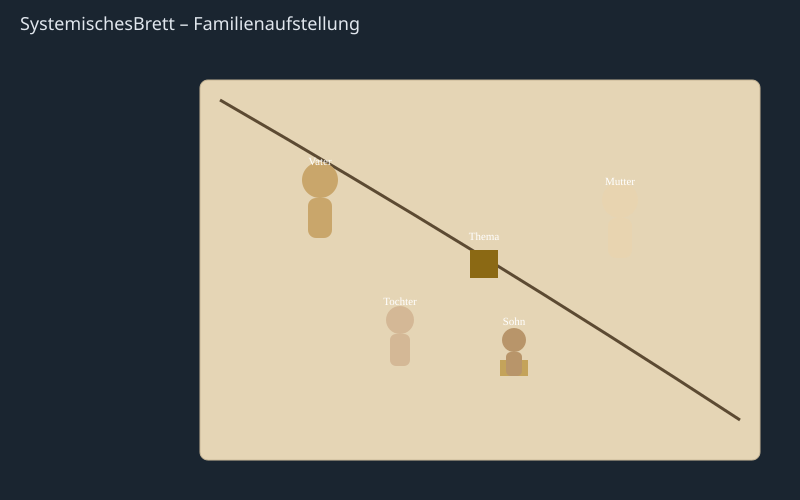

# SystemischesBrett

Interaktives **3D systemisches Brett** (Holzfiguren-Aufstellung) – als **Zoom App** und standalone im Browser.



*Beispiel-Familienaufstellung: Vater, Mutter, Tochter, Sohn (auf Podest) und Würfel „Thema“ – mit Schlangenlinie auf dem Brett.*

## Features

- 3D-Brett mit Holzfiguren (groß / mittel / klein), Würfel und Scheibe
- Ziehen, drehen, beschriften, Holzton wählen, Podest
- Kamera-Presets (Iso, Oben, Seite, Front)
- Undo / Redo
- **Speichern unter** mit Namen und **Versionierung** (localStorage)
- Laden und Löschen gespeicherter Stände
- **Zoom App**: Meeting-Kontext, App teilen, Brett-Sync zwischen Teilnehmern

## Start (Standalone)

```bash
npm install
npm run dev
```

App: [http://localhost:3000](http://localhost:3000)

| Query | Modus |
|--------|--------|
| *(ohne)* | Auto: Zoom-SDK falls im Client, sonst Standalone |
| `?zoom=1` | **Demo-Meeting** (Status + Zoom-Buttons ohne echten Client) |
| `?zoom=0` | Erzwungen **Standalone** |

## Zoom App

### Architektur

```
src/zoom/
  types.ts       # BoardSyncPayload, ZoomAppStatus
  zoomClient.ts  # initZoomApp(), SDK-Config, Fallback
  useZoomApp.ts  # React-Hook
  index.ts
```

Genutzte Zoom Apps SDK Capabilities:

| API / Event | Zweck |
|-------------|--------|
| `config` | Initialisierung |
| `getRunningContext` | inMeeting / inMainClient / … |
| `getUserContext` | Anzeigename, Rolle |
| `getMeetingContext` | Meeting-Titel |
| `shareApp` | App-Ansicht mit Teilnehmern teilen |
| `postMessage` / `onMessage` | Brett-Zustand synchronisieren |
| `expandApp` | Panel vergrößern |
| `openUrl` | Externe Links |

Außerhalb von Zoom läuft die App unverändert im Browser (Standalone).

### Marketplace / Manifest

Vorlage: [`zoom-app-manifest.template.json`](zoom-app-manifest.template.json)

1. App im [Zoom Marketplace](https://marketplace.zoom.us/) als **Zoom App** anlegen  
2. Scope **`zoomapp:inmeeting`** aktivieren  
3. Unter Zoom App SDK die APIs aus der Vorlage freischalten  
4. **Home URL** + **Domain Allow List** auf eure HTTPS-URL setzen (lokal: ngrok)  
5. Domain `appssdk.zoom.us` in der Allow List belassen  

Lokal mit Tunnel:

```bash
npm run dev
# anderes Terminal:
ngrok http 3000
# ngrok-HTTPS-URL als Home URL / Domain in der Marketplace-App eintragen
```

### UI in Zoom

- Status-Badge: Kontext (inMeeting, Nutzer, Meeting-Titel)
- **App teilen** → `shareApp`
- **Erweitern** → `expandApp`
- **Brett synchronisieren** → `postMessage` (Board-Sync an andere Instanzen)
- Figuren-Änderungen werden debounced (~400 ms) mitgesendet

## E2E-Tests (Playwright)

```bash
npm install
npx playwright install chromium
npm run test:e2e          # alle Tests
npm run test:e2e:zoom     # nur Zoom-Suite
```

### Test-Struktur

| Datei | Inhalt |
|--------|--------|
| `e2e/helpers.ts` | `openApp`, `addFigure`, `saveUnder`, … |
| `e2e/app.spec.ts` | UI, Figuren, Speichern/Versionierung, Kamera |
| `e2e/smoke.spec.ts` | Gesamtflow speichern/laden |
| `e2e/zoom.spec.ts` | Standalone vs. `?zoom=1` Meeting-UI |
| `e2e/zoom-unit.spec.ts` | Status-Badge & Capabilities-Wiring |

Zoom-Tests nutzen **`?zoom=1` / `?zoom=0`** und brauchen keinen echten Zoom-Client.

## Tech-Stack

- React 19 + TypeScript + Vite
- Three.js / React Three Fiber / Drei
- **@zoom/appssdk** (Zoom Apps SDK)
- Playwright (E2E)

## Lizenz

Privat / nach Absprache – Repository: [inwuerde/SystemischesBrett](https://github.com/inwuerde/SystemischesBrett)
